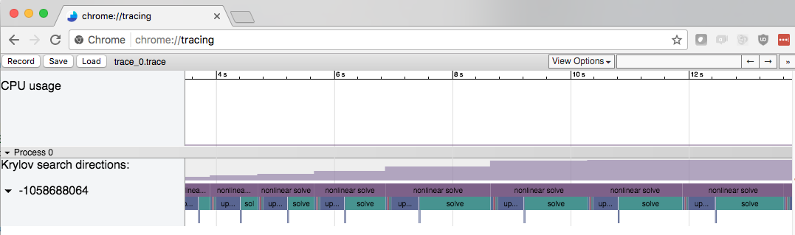

.. title:: Collect Code Performance with Tracer

Tracer is a utility library that to create
.json files for use in Chrome's tracer profiler.

Requirements
============
C++11 compatible compiler (language and stdlib).

Cmake is supported for version 3.0.0 or higher.

Basic Tutorial
==============

Tracer creates log files using symmetric Tracer:: calls.

.. code-block:: cpp

    Tracer::begin("cool event I want to track");
    // do cool event
    Tracer::end("cool event I want to track");

Tracer produces .trace files.  Load these files in Chrome by going to
chrome://tracing, select load, and pointing to the trace file.

.. warning::
    Event strings have to match.  This the following will result in an unclosed event:

    .. code-block:: cpp

        Tracer::begin("These strings do     match?");
        // not cool event.
        Tracer::end("These strings do not match.");

Authors
=======
Tracer was jointly developed by Matthew O'Connell and Cameron Druyor
as part of the Parfait toolkit.

Comments / Questions:
Matthew.D.OConnell@nasa.gov

.. toctree::
   :maxdepth: 2
   :caption: Contents: